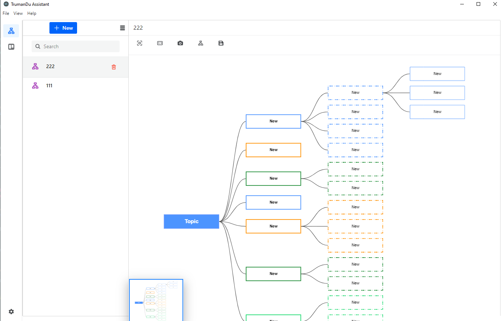

<p>
  TrumanDu Assistant uses <a href="https://electron.atom.io/">Electron</a>, <a href="https://facebook.github.io/react/">React</a>, <a href="https://github.com/reactjs/react-router">React Router</a>, <a href="https://webpack.js.org/">Webpack</a> and <a href="https://www.npmjs.com/package/react-refresh">React Fast Refresh</a>.
</p>



<br>

<br>

## Install

Clone the repo and install dependencies:

```bash
git clone --depth 1 --branch main https://github.com/TrumanDu/TDA your-project-name
cd your-project-name
npm install
```

## Starting Development

Start the app in the `dev` environment:

```bash
npm start
```

## Packaging for Production

To package apps for the local platform:

```bash
npm run package
```

## Donations

**微信（Wechat）打赏**


